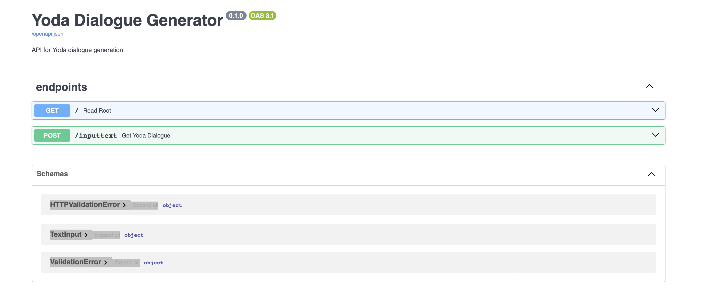

# Yoda Dialogue Generator


## Project Overview
---------------------------
### Yoda AI Chatbot Usecase

The Yoda chatbot generator aims to transform your text into a Yoda-style text formulation using the OpenAI GPT service. The backend's endpoint is prompt-engineered to generate the desired output style.

Note that the user-specific OpenAI API key must be stored in the root directory with the name `api_key.txt` to be able to run this project.

## Directory Setup
------------------
The folder structure with the relevant scripts and files

```markdown
    ├── images
    │    └── ...                        # usecase/solution images
    ├── src
    │    ├── app_streamlit.py           # frontend app script
    │    └── main.py                    # backend main API script             
    ├── prompt_message.txt              # prompt engineering text
    ├── README.md
    └── requirements.txt
```


## Local Execution
### Prerequisites
----------------

This project involves development using the Python `3.10` version. The necessary requirements need to be installed to develop.

It is highly recommended to set up a virtual environment.

After setting up the virtual environment, you can install the requirements through the following command:

```
pip install -r requirements.txt
```

### Execution
------------

To be able to run the script locally, execute the following commands under the `src` folder:

```
python3 main_api.py
```

The following output will be displayed:

```
Uvicorn running on http://0.0.0.0:8000
```

To use the API's interactive documentation and exploration web user interface, aka Swagger UI, call `http://0.0.0.0:8000/docs` from your browser. This is the API's Swagger UI.



Furthermore, to use the frontend UI, keep the backend API running and execute in another terminal under the `src` folder the following:

```
streamlit run app_streamlit.py
```

You will be directly forwarded to the UI, or you can call `http://localhost:8501` from your browser. The UI looks as the following:


## Author
---------

* **Sevag Kevork** - *Author/Data Scientist* - [me@sevagkevork.net](https://github.com/kevorks)


